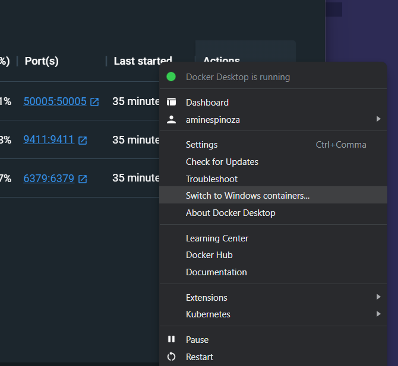
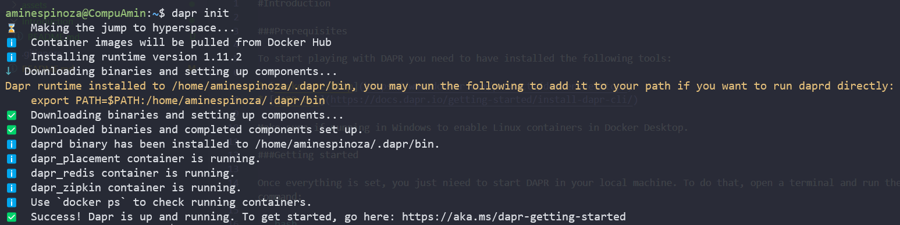
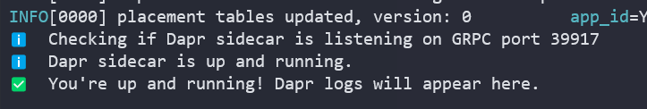
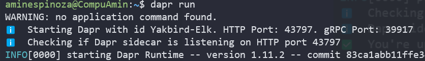

#Introduction

###Prerequisites

To start playing with DAPR you need to have installed the following tools:

* [Docker Desktop](https://www.docker.com/products/docker-desktop/)
* [DAPR CLI](https://docs.dapr.io/getting-started/install-dapr-cli/)

Make sure if running in Windows to enable Linux containers in Docker Desktop.



###Getting started

Once everything is set, you just nieed to start DAPR in your local machine. To do that, open a terminal and run the following command:

```bash
dapr init
```


After this, you can now run Dapr locally.

```bash
dapr run
```


You now only need to see the port Dapr is running, you can see it in the terminal right after the command.



With it, you can start sending requests to Dapr with [endpoints.http](endpoints.http) file in this folder and this way you can see how to deal with states using Dapr.
